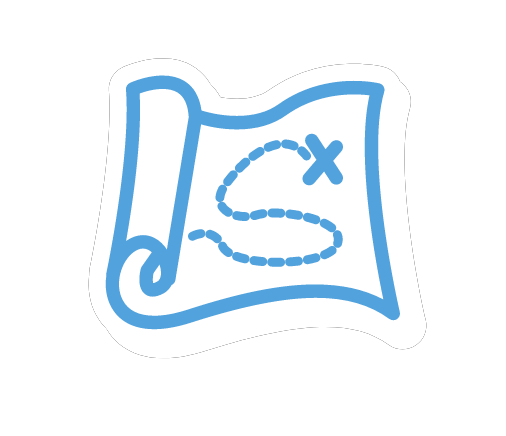

Our plans are essentially our game plan, populated with the qualitative and quantitative knowledge we have gained from discussions with stakeholders. They guide how we are implementing the change in a concrete way. This is contrasted with our change strategy, which is more about the broad strokes approach to the change and will guide the drafting of our plans.

When determining how to position our plans as part of our overall strategy, we gain by being cognizant of our organizational culture and ways of operating. For example, when thinking about our risk management plan it is helpful to validate how formally our organization manages risk. Some organizations have institutionalized approaches and processes related to risk. If that is the case, it may be wise to work with this key group to increase coherence and consistency.

Other organizational cultures may favour different labels, such as putting forward a specific sponsorship plan, rather than incorporating the sponsorship approach as part of the broader change plan or engagement plan. The point here is that it is okay to tailor our various plans to what best fits organizational preferences, as long as we have the key components necessary to ensure our change successful.

Here we will develop our:

- [Change plan](/framework-for-leading-change/change-plan/)

- [Engagement plan](/framework-for-leading-change/engagement-plan/)

- [Risk management plan](/framework-for-leading-change/risk-plan/)

- [Communications plan](/framework-for-leading-change/communications-plan/)

- [Human resources plan](/framework-for-leading-change/human-resources-plan/)

- [Training/learning plan](/framework-for-leading-change/training-learning-plan)

- [Reinforcement/sustainability plan](/framework-for-leading-change/reinforcement-sustainability-plan/)

* * *

[Next: Change plan](/framework-for-leading-change/change-plan/)

[Back to beginning of framework](/framework-for-leading-change/)

* * *
