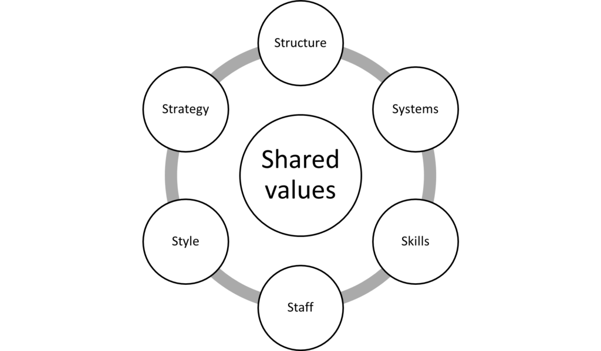

Assessing the implications of our change for different parts of the organization will help us better understand where we are likely to see support for the change and where we may run into barriers.

Ultimately, we want to build on the work we have been doing with our stakeholders throughout the process (e.g., from our discussions on interdependencies). We also gain by taking a holistic perspective of the organization to help us recognize opportunities and minimize gaps and surprises.

**How can we assess the impact of the change?**

There are a number of tools we can use to assess organizational impact (e.g., Prosci’s organizational impact assessment, Human Systems Dynamics’ Adaptive Action model, the McKinsey 7S Framework). Each of these offers a different perspective on the organization. No matter which approach we follow, the idea is to be as holistic as possible when evaluating the impact of the change, in order to maximize opportunities and minimize surprises, taking into account the interdependent aspects.

One way we can assess organizational impact is by using the lens of the [McKinsey 7S Framework](https://www.mckinsey.com/business-functions/strategy-and-corporate-finance/our-insights/enduring-ideas-the-7-s-framework). The seven categories are the following:

- Strategy – our long-term planning and goals

- Structure – how the institution is organized, e.g., reporting lines

- Systems – formal and informal processes that govern our day-to-day operations

- Skills – capabilities and competencies

- Shared values – work culture, belief systems

- Staff – our people

- Style – our leadership approach

Each of these is interconnected, rather than linear and hierarchical.

_Getting it down on paper_

The good news is that our consistent, deep engagement with stakeholders has likely already provided us with the quantitative and qualitative data we need to do our analysis (refer to the sections: Building our case for change; Creating our vision of the future; Setting out our conditions for success; Analyzing the environment/drivers and barriers; Determining where our change fits; Understanding our interdependencies; Change saturation and fatigue; and, Assess how ready we are to implement the change).

What we are looking to understand is where we are today, where the gaps are, what actions we may need to take, and what impact this might have through the lens of the 7 aspects of the model.

Ultimately, the McKinsey 7S framework is one among many (for more information on how to use the model, we can consult the [McKinsey website on the 7S](https://www.mckinsey.com/business-functions/strategy-and-corporate-finance/our-insights/enduring-ideas-the-7-s-framework) Framework). No matter which approach we use, we gain by viewing the organization holistically and interdependently, identifying the lens (or categories) we want to use to view the organization and conducting our impact assessment based on our discussions with stakeholders.

**Next steps**

Now that we better understand the impacts of the change on our organization, we can do an analysis of the impact on our stakeholders.

* * *

[Next: Stakeholder impact assessment](/framework-for-leading-change/stakeholder-impact-assessment/)

[Back to beginning of section](/framework-for-leading-change/capacity-readiness-and-impact/)

* * *
